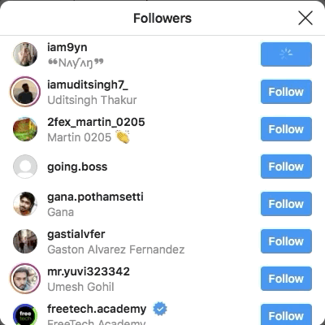

# Day 52 - Instagram Follower Bot

A Python automation project that uses Selenium to automatically follow accounts on Instagram.

## What This Project Does

The program:

1. Opens Instagram.
2. Logs into the user's account.
3. Searches for a target Instagram account.
4. Opens the account's followers list.
5. Automatically follows users from the followers list.

## Technologies Used

- Python
- Selenium
- Web Automation
- Instagram

  ## Instagram Follower Bot


## Project Structure

```text
Day-52-Instagram-Follower-Bot/
│
├── main.py
├── README.md
└── requirements.txt
