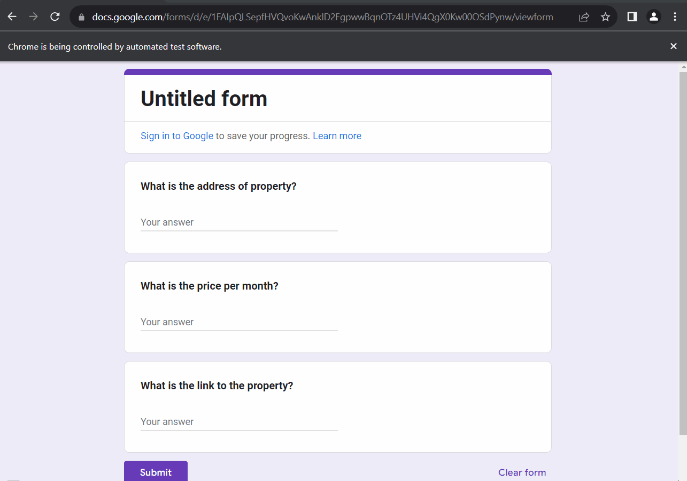

# Day 53 - Data Entry Job Automation

A Python automation project that collects property information from a website and automatically enters the data into a Google Form.

## What This Project Does

The program:

1. Opens a real estate website.
2. Scrapes property listings.
3. Extracts property information such as:
   - Property address
   - Price
   - Listing URL
4. Opens a Google Form.
5. Automatically enters the collected information into the form.
6. Submits the form for each property.

## Technologies Used

- Python
- Requests
- BeautifulSoup
- Selenium
- Web Scraping
- Web Automation
- Google Forms

## Data Entry Bot


## Project Structure

```text
Day-53-Data-Entry-Job-Automation/
│
├── main.py
├── README.md
└── requirements.txt
