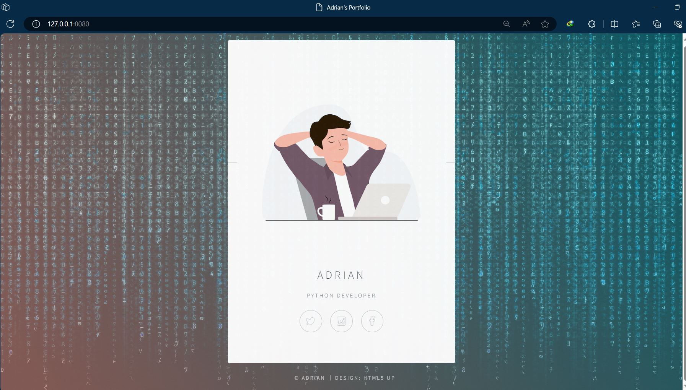

# Day 56 - Flask: Rendering HTML, Static Files & Templates

This project is part of my **100 Days of Code: Python Bootcamp** journey.

## 📌 What I Learned

On Day 56, I learned how to build a simple website using **Flask** and how Flask works with HTML templates and static files.

### Concepts Covered

- Creating a Flask web application
- Running a Flask development server
- Rendering HTML pages using `render_template()`
- Using the `templates` folder
- Serving CSS, images, and other static files
- Using the `static` folder
- Linking CSS files to HTML
- Working with HTML templates
- Using Flask routes

## 🛠️ Technologies Used

- Python
- Flask
- HTML
- CSS

  ## Name Card Website


## 📂 Project Structure

```text
Day56/
│
├── static/
│   └── assets/
│       ├── css/
│       └── images/
│
├── templates/
│   └── index.html
│
├── portfolio.JPG
├── server.py
└── README.md

