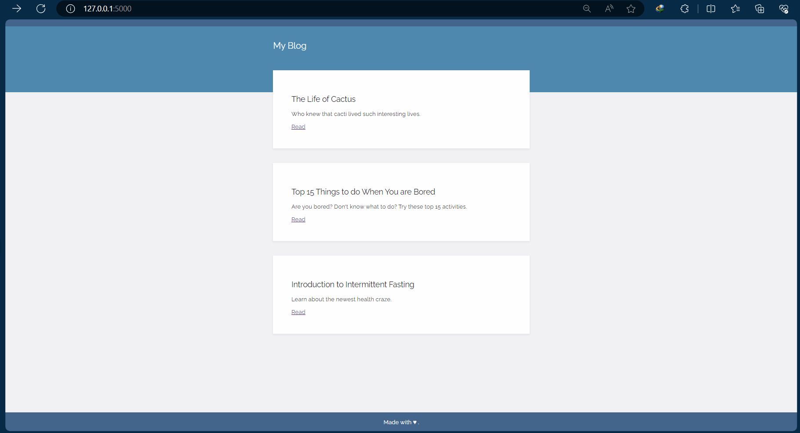

# Day 57 - Blog Website with Jinja

A dynamic blog website built with Flask and Jinja templating.

## What This Project Does

The program:

1. Runs a Flask web server.
2. Fetches blog post data.
3. Passes the data from Python to HTML.
4. Uses Jinja to dynamically display the blog posts.
5. Uses reusable HTML templates.
6. Allows individual blog posts to be displayed dynamically.

## Technologies Used

- Python
- Flask
- Jinja
- HTML
- CSS
- JSON / API Data

## Blog Capstone Project Part 1 - Templating


## Project Structure

```text
Day-57-Blog/
│
├── main.py
├── templates/
│   ├── index.html
│   ├── post.html
│   └── header.html
├── static/
│   └── css/
│       └── styles.css
├── README.md
└── requirements.txt

