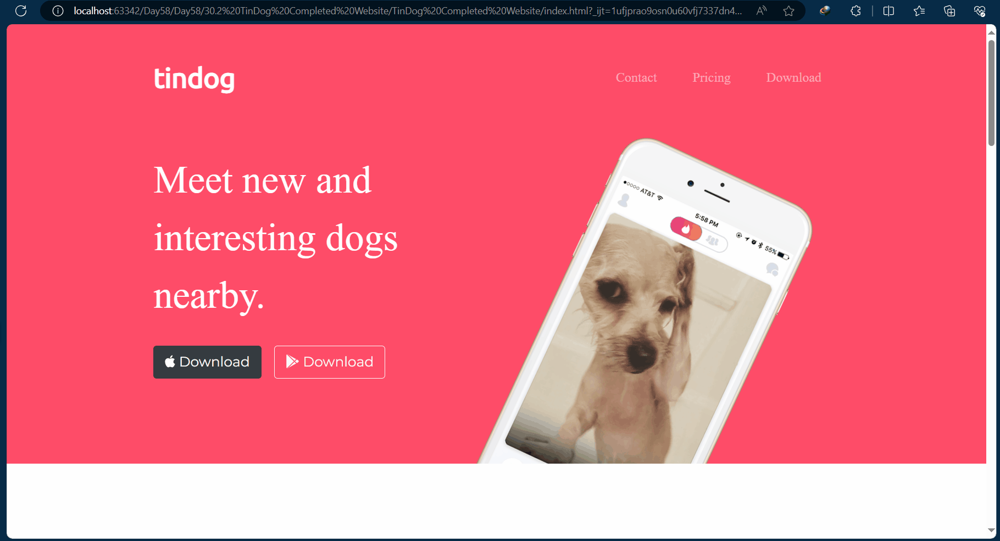

---

# Day 58 — Tindog / Bootstrap

```markdown
# Day 58 - Tindog Website

A responsive landing page built using HTML, CSS, and Bootstrap.

The project recreates a modern landing page for a fictional dog dating application called Tindog.

## What This Project Does

The website contains multiple sections including:

- Navigation bar
- Hero section
- Features section
- Testimonials
- Press / company logos
- Pricing plans
- Call-to-action section
- Footer

The main focus of this project is learning how to use Bootstrap to quickly build responsive web pages.

## Technologies Used

- HTML
- CSS
- Bootstrap
- Bootstrap Icons / Font Awesome

## Project Structure

```text
Day-58-Tindog/
│
├── index.html
├── css/
│   └── styles.css
├── images/
│   └── ...
└── README.md
```
## Bootstrap Website

