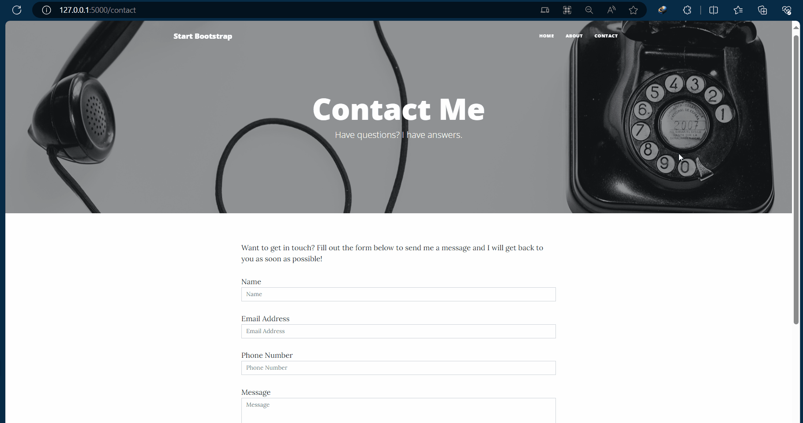

# Day 60 - Flask Contact Form

A Flask web application that uses HTML forms and POST requests to collect user information and send it through email.

## Functional Contact Form



## What This Project Does

The website:

1. Displays a contact form.
2. Allows users to enter their name, email, phone number, and message.
3. Sends the form data to the Flask server.
4. Uses a POST request to process the submitted data.
5. Sends the information through email using SMTP.
6. Displays a success page after submission.

## Technologies Used

* Python
* Flask
* HTML
* Jinja
* SMTP
* Email
* HTTP GET and POST Requests

## Project Structure

```text
Day-60-Contact-Form/
│
├── main.py
├── templates/
│   ├── contact.html
│   └── success.html
├── static/
│   └── css/
│       └── styles.css
├── README.md
└── requirements.txt
```

## Installation

Install Flask:

```bash
pip install flask
```

Or:

```bash
pip install -r requirements.txt
```

## HTML Forms

The contact form collects information from the user.

Example:

```html
<form method="POST">
    <input name="name">
    <input name="email">
    <textarea name="message"></textarea>
    <button type="submit">Send</button>
</form>
```

## GET vs POST

### GET

Used mainly to request or display a page.

```python
@app.route("/contact")
def contact():
    return render_template("contact.html")
```

### POST

Used when the user submits data to the server.

```python
@app.route("/contact", methods=["GET", "POST"])
```

The submitted data can be accessed using:

```python
request.form["name"]
```

## Sending Email

The project uses Python's `smtplib` to send the submitted information through email.

Sensitive information such as email passwords should never be hard-coded.

Use environment variables instead.

## Example Workflow

```text
User opens Contact Page
        ↓
Fills HTML Form
        ↓
Clicks Submit
        ↓
POST Request
        ↓
Flask receives form data
        ↓
Python processes data
        ↓
Email is sent
        ↓
Success Page
```

## Concepts Practiced

* Flask
* HTML forms
* GET requests
* POST requests
* `request.form`
* Form data
* `smtplib`
* Sending emails
* Jinja
* Flask routes
* HTTP methods
* Environment variables

## Running the Project

```bash
python main.py
```

Then open:

```text
http://127.0.0.1:5000/contact
```

## Security

Never upload:

* Email passwords
* API keys
* Authentication tokens
* Personal credentials

Use environment variables or a `.env` file.

## Learning Outcome

Day 60 teaches how a Flask application can receive information from an HTML form using POST requests and process that information on the backend.

## Disclaimer

This project was created for educational purposes as part of Angela Yu's 100 Days of Code: The Complete Python Pro Bootcamp.

