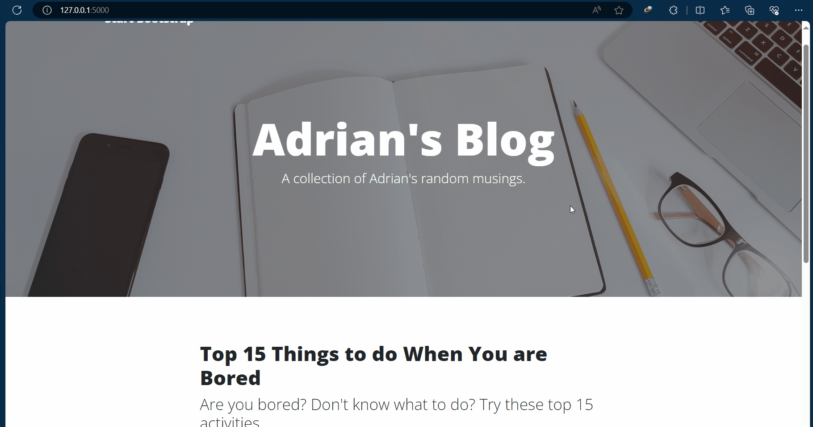

# Day 67 – Blog Capstone Project

## 📌 Overview

Day 67 is a **Blog Capstone Project** built using **Python, Flask, HTML, CSS, and Jinja2**.

The project focuses on creating a dynamic blog website where users can view blog posts and interact with different pages. It combines the Flask concepts learned throughout the previous days into a complete web application.

---

## Blog Capstone Project Part 3


## 🚀 Features

* 🏠 Home page displaying blog posts
* 📖 Individual blog post pages
* 📝 Dynamic content using Jinja2 templates
* 🎨 HTML/CSS based frontend
* 🐍 Flask backend
* 🔗 Dynamic URL routing
* 📦 Reusable template structure
* 📄 About and Contact pages
* ⚡ Flask development server with debug mode

---

## 🛠️ Technologies Used

* **Python**
* **Flask**
* **HTML5**
* **CSS3**
* **Jinja2**
* **Bootstrap**
* **Requests**
* **JSON / API data**

---

## 📂 Project Structure

```text
day-67-blog-capstone/
│
├── static/
│   ├── assets/
│   └── css/
│
├── templates/
│   ├── index.html
│   ├── post.html
│   ├── about.html
│   ├── contact.html
│   └── header.html
│
├── main.py
├── requirements.txt
└── README.md
```

---

## 🧠 Concepts Learned

### Flask Routing

Different URLs can be connected to different Python functions.

```python
@app.route("/")
def home():
    return render_template("index.html")
```

### Dynamic Routes

A route can contain a variable value.

```python
@app.route("/post/<int:index>")
def show_post(index):
    ...
```

This allows different blog posts to be displayed using the same template.

### Jinja2 Templates

Jinja2 allows Python data to be passed into HTML.

```html

    <h2>{{ post.title }}</h2>

```

### Template Inheritance

Common website components can be reused instead of writing the same HTML repeatedly.

```html

```

### Passing Data to Templates

Flask can send Python variables to an HTML template.

```python
return render_template("index.html", posts=posts)
```

---

## 🔄 How the Project Works

1. Flask starts the web server.
2. The application receives a request.
3. The appropriate route is selected.
4. Python retrieves the required blog data.
5. The data is passed to the Jinja2 template.
6. Jinja2 dynamically generates the HTML.
7. The browser displays the final webpage.

---

## ▶️ How to Run

Clone or download the project and navigate into the project folder.

Install the required packages:

```bash
pip install -r requirements.txt
```

Run the Flask application:

```bash
python main.py
```

Then open the local Flask server in your browser.

---

## 📚 What I Practiced

* Flask application structure
* URL routing
* Dynamic routes
* Jinja2 syntax
* Template inheritance
* Passing data from Python to HTML
* Working with blog/API data
* Creating a multi-page web application
* Organizing a Flask project

---

## 🎯 Day 67 Goal

The goal of this project was to move from small Flask exercises to building a **complete dynamic web application** while combining the Flask, HTML, CSS, API, and templating concepts learned so far.

---

## 💻 Part of

**100 Days of Code – Python Bootcamp**

Day 67 completed ✅
