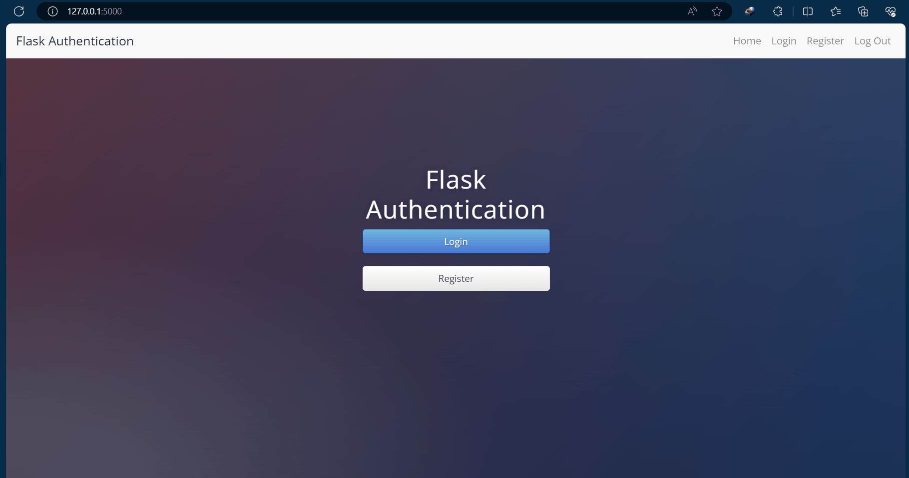

# Day 68 – Authentication with Flask

## 📌 Overview

Day 68 focuses on adding **user authentication and registration** to a Flask web application.

In this project, I learned how to create a registration and login system, securely handle user passwords, and manage logged-in users using **Flask-Login** and **Flask-SQLAlchemy**.

The project demonstrates how a backend application can identify users and restrict certain pages to authenticated users.

---
## Flask Authentication Website


## 🚀 Features

* 👤 User registration
* 🔐 User login
* 🚪 User logout
* 🔒 Protected routes
* 🗄️ Database-backed user accounts
* 🔑 Password hashing
* ✅ Login validation
* 📋 User session management
* ⚠️ Flash messages for authentication errors

---

## 🛠️ Technologies Used

* **Python**
* **Flask**
* **Flask-SQLAlchemy**
* **Flask-Login**
* **Werkzeug**
* **SQLite**
* **HTML5**
* **CSS3**
* **Jinja2**
* **Bootstrap**

---

## 📂 Project Structure

```text
day-68-authentication/
│
├── static/
│   ├── css/
│   └── img/
│
├── templates/
│   ├── index.html
│   ├── login.html
│   ├── register.html
│   └── secrets.html
│
├── instance/
│   └── users.db
│
├── main.py
├── requirements.txt
└── README.md
```

---

## 🧠 Concepts Learned

### Flask-Login

`Flask-Login` helps manage logged-in users.

It provides functionality such as:

* Login management
* Logout
* User sessions
* Protecting routes
* Checking whether a user is authenticated

Example:

```python
from flask_login import login_user
```

---

### User Model

Users can be stored in a database using SQLAlchemy.

Example:

```python
class User(db.Model):
    id = db.Column(db.Integer, primary_key=True)
    email = db.Column(db.String(100), unique=True)
    password = db.Column(db.String(100))
```

Each registered user gets a record in the database.

---

### Password Hashing

Passwords should **never be stored as plain text**.

Instead, the password is converted into a hash.

```python
from werkzeug.security import generate_password_hash

hashed_password = generate_password_hash(
    password,
    method="pbkdf2:sha256",
    salt_length=8
)
```

When logging in, the entered password can be checked against the stored hash.

```python
from werkzeug.security import check_password_hash

check_password_hash(
    stored_password,
    entered_password
)
```

---

## 🔐 Login Flow

The authentication process works approximately like this:

```text
User enters email + password
          ↓
Flask receives form data
          ↓
Search database for user
          ↓
User found?
     ↙          ↘
   No            Yes
   ↓              ↓
Error       Check password
                 ↓
            Password correct?
              ↙       ↘
            No         Yes
            ↓           ↓
          Error    login_user()
                        ↓
                  User logged in
```

---

## 📝 Registration Flow

```text
User opens Register page
          ↓
Enters email + password
          ↓
Flask receives form
          ↓
Check whether user exists
          ↓
Hash password
          ↓
Create User object
          ↓
Save to database
          ↓
Login user / redirect
```

---

## 🔒 Protected Routes

Some pages should only be accessible to logged-in users.

Flask-Login provides:

```python
from flask_login import login_required
```

A protected route can be created with:

```python
@app.route("/secrets")
@login_required
def secrets():
    return render_template("secrets.html")
```

If the user isn't logged in, they won't be allowed to access the protected page.

---

## 👤 Current User

Flask-Login provides:

```python
current_user
```

This represents the currently logged-in user.

Example:

```python
from flask_login import current_user
```

You can access information such as:

```python
current_user.email
```

---

## 🚪 Logout

Logging out can be handled using:

```python
from flask_login import logout_user
```

Example:

```python
@app.route("/logout")
def logout():
    logout_user()
    return redirect(url_for("home"))
```

---

## 🗄️ Database

The application uses **SQLite** to store user information.

SQLAlchemy provides an easier way to interact with the database using Python objects instead of writing raw SQL for every operation.

Example:

```python
new_user = User(
    email=email,
    password=hashed_password
)

db.session.add(new_user)
db.session.commit()
```

---

## 🔄 Authentication Architecture

```text
             Browser
                │
                ↓
             Flask
                │
        ┌───────┴────────┐
        ↓                ↓
   Registration        Login
        │                │
        └───────┬────────┘
                ↓
            Database
                │
                ↓
        Flask-Login Session
                │
                ↓
        Protected Routes
```

---

## ▶️ How to Run

Install the required dependencies:

```bash
pip install -r requirements.txt
```

Run the application:

```bash
python main.py
```

Open the local Flask server in your browser.

---

## 📚 What I Practiced

* Creating user registration
* Creating a login system
* Logging users in and out
* Using Flask-Login
* Protecting Flask routes
* Using `current_user`
* Working with SQLAlchemy
* Creating database models
* Storing users in SQLite
* Hashing passwords
* Verifying hashed passwords
* Handling authentication errors

---

## 🎯 Day 68 Goal

The main goal of Day 68 was to understand how authentication works in a Flask application and how a backend can:

1. Register users
2. Store their information securely
3. Authenticate login credentials
4. Maintain a logged-in session
5. Restrict access to protected pages
6. Log users out

---

## 💡 Key Takeaways

```text
Flask
  ↓
User Registration
  ↓
Hash Password
  ↓
Store User in Database
  ↓
Login
  ↓
Verify Password
  ↓
login_user()
  ↓
Protected Routes
  ↓
logout_user()
```

### Most Important Functions

```python
generate_password_hash()
check_password_hash()

login_user()
logout_user()

@login_required

current_user
```

---

## 💻 Part of

**100 Days of Code – Python Bootcamp**

Day 68 completed ✅

