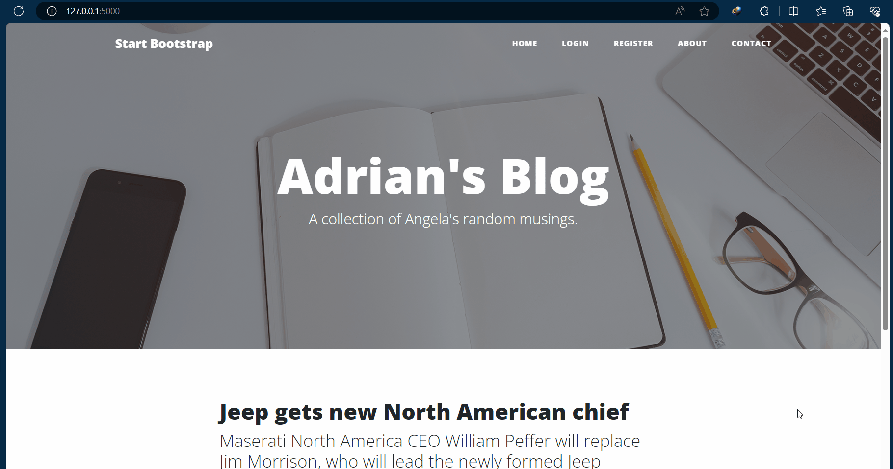

# Day 69 – Blog with Authentication & Database

## 📌 Overview

Day 69 builds on the Flask authentication concepts from Day 68 by creating a more complete **blog application with user authentication, database relationships, and protected content**.

The project combines Flask, SQLAlchemy, Flask-Login, Jinja2, and Bootstrap to create a dynamic blog where users can register, log in, and interact with blog content.

---

## Blog Capstone Project Part 4


## 🚀 Features

* 👤 User registration
* 🔐 User login and logout
* 🔒 Protected routes
* 📝 Create blog posts
* 💬 Add comments to blog posts
* 🗄️ Store users, posts, and comments in a database
* 🔗 Database relationships between users and posts
* 🔑 Password hashing
* 👤 Display the currently logged-in user
* ⚡ Dynamic blog pages
* 🎨 Responsive Bootstrap-based interface

---

## 🛠️ Technologies Used

* **Python**
* **Flask**
* **Flask-SQLAlchemy**
* **Flask-Login**
* **SQLite**
* **Werkzeug**
* **Jinja2**
* **HTML5**
* **CSS3**
* **Bootstrap**

---

## 📂 Project Structure

```text
day-69-blog/
│
├── static/
│   ├── css/
│   └── img/
│
├── templates/
│   ├── index.html
│   ├── post.html
│   ├── login.html
│   ├── register.html
│   ├── make-post.html
│   ├── about.html
│   └── contact.html
│
├── instance/
│   └── posts.db
│
├── main.py
├── requirements.txt
└── README.md
```

---

## 🧠 Concepts Learned

### Database Models

Different types of data are represented using SQLAlchemy models.

For example:

```python
class User(db.Model):
    id = db.Column(db.Integer, primary_key=True)
    email = db.Column(db.String(100), unique=True)
    password = db.Column(db.String(100))
```

A blog can also have models for:

* Blog posts
* Comments
* Users

---

## 🔗 Database Relationships

A major concept introduced is connecting different database tables.

For example:

```text
User
 │
 ├── creates → Blog Post
 │
 └── writes  → Comment

Blog Post
 │
 └── contains → Comments
```

This allows the application to associate content with the users who created it.

---

## 👤 Authentication

The project continues using Flask-Login.

Important components include:

```python
login_user()
logout_user()
current_user
@login_required
```

These allow the application to determine whether a user is logged in and restrict access to certain features.

---

## 🔐 Password Security

Passwords are not stored directly.

Instead:

```python
generate_password_hash()
```

is used when registering a user.

During login:

```python
check_password_hash()
```

is used to verify the entered password.

---

## 📝 Creating Blog Posts

Authenticated users can create blog posts.

The general flow is:

```text
User logs in
     ↓
Open "Create Post"
     ↓
Enter post details
     ↓
Submit form
     ↓
Flask receives POST request
     ↓
Create database object
     ↓
Save using SQLAlchemy
     ↓
Redirect to blog
```

---

## 💬 Comments

Users can also interact with blog posts through comments.

A comment can be associated with:

```text
User
  +
Blog Post
  ↓
Comment
```

This introduces the idea of connecting multiple database records.

---

## 🧩 Jinja2

Jinja2 is used to dynamically generate HTML.

Example:

```html
<h1>{{ post.title }}</h1>
<p>{{ post.body }}</p>
```

Loops can be used to display multiple comments:

```html

    <p>{{ comment.text }}</p>

```

---

## 🔒 Protected Routes

Features that require authentication can be protected using:

```python
@app.route("/new-post")
@login_required
def new_post():
    ...
```

A user who isn't logged in cannot access the protected functionality.

---

## 🗄️ SQLAlchemy

SQLAlchemy allows Python code to interact with the database.

Adding a record:

```python
db.session.add(new_post)
db.session.commit()
```

Querying data:

```python
posts = BlogPost.query.all()
```

Finding a specific record:

```python
post = BlogPost.query.get(post_id)
```

---

## 🔄 Application Flow

```text
                    Flask Application
                           │
            ┌──────────────┼──────────────┐
            ↓              ↓              ↓
        Register         Login        Blog Pages
            │              │              │
            ↓              ↓              ↓
         User DB      Flask-Login      Post DB
                           │
                           ↓
                    Protected Routes
                           │
                           ↓
                    Create / Comment
```

---

## ▶️ How to Run

Install the required dependencies:

```bash
pip install -r requirements.txt
```

Run the Flask application:

```bash
python main.py
```

Open the local Flask server in your browser.

---

## 📚 What I Practiced

* Flask authentication
* Flask-Login
* User sessions
* Protected routes
* SQLAlchemy models
* Database queries
* Creating database records
* Database relationships
* Blog post creation
* Comment functionality
* Jinja2 dynamic templates
* HTML forms
* GET and POST requests
* Password hashing
* Bootstrap integration

---

## 🎯 Day 69 Goal

The goal of Day 69 was to move beyond a simple authentication system and understand how **authentication and databases work together inside a larger Flask application**.

The project combines:

```text
Flask
+
Authentication
+
Database
+
Relationships
+
Templates
+
Forms
```

to create a more realistic web application.

---

## 💡 Key Takeaways

```text
User
 ↓
Register
 ↓
Password Hash
 ↓
Database
 ↓
Login
 ↓
Flask-Login
 ↓
Authenticated Session
 ↓
Protected Routes
 ↓
Create Posts / Comments
 ↓
Database Relationships
```

---

## 💻 Part of

**100 Days of Code – Python Bootcamp**

Day 69 completed ✅
