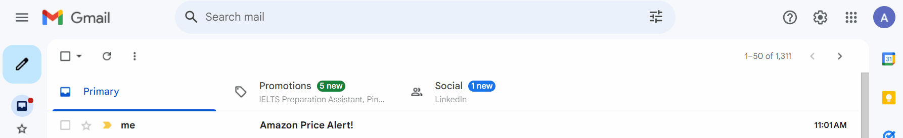

# Day 47 - Amazon Price Tracker

A Python project that tracks the price of a product on Amazon and sends an email notification when the price drops below a target price.

## What This Project Does

The program:

1. Opens an Amazon product page.
2. Gets the current product price.
3. Compares it with a target price.
4. If the current price is lower than the target price, it sends an email notification.

## Technologies Used

- Python
- Requests
- BeautifulSoup
- SMTP
- Web Scraping

## Amazon Price Tracker


## Project Structure

```text
Day-47-Amazon-Price-Tracker/
│
├── main.py
├── README.md
└── requirements.txt
